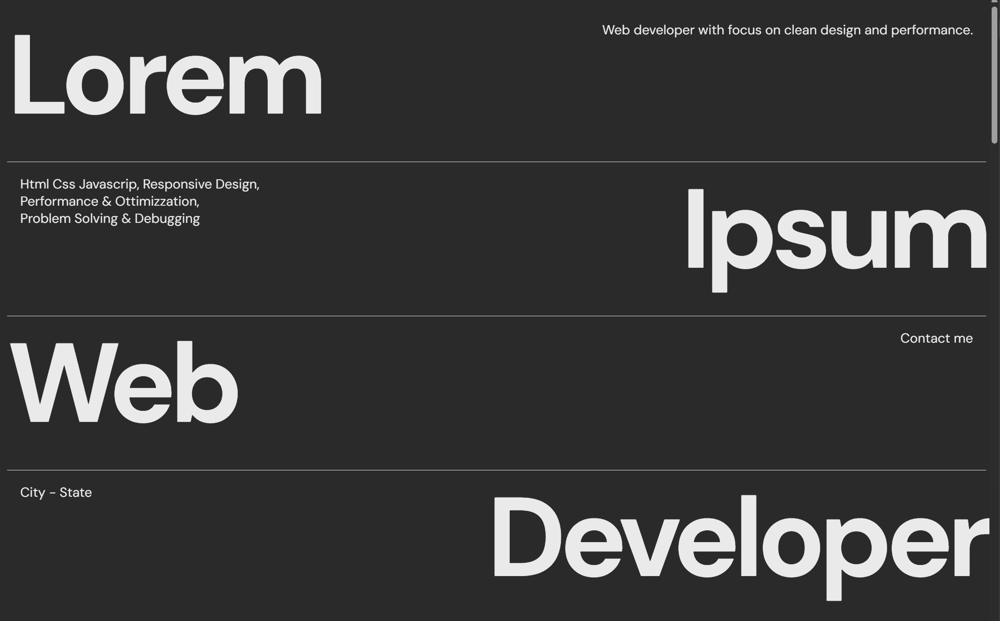

# Portfolio Clone - Daniel Jagerskog Inspired

This is a front-end project built as a learning exercise. It is a clone inspired by the portfolio of [Daniel Jagerskog](https://www.danieljagerskog.com/), developed using HTML, CSS, and JavaScript.

## Table of Contents

- [Overview](#overview)
- [Screenshot](#screenshot)
- [Links](#links)
- [Built With](#built-with)
- [What I Learned](#what-i-learned)
- [Author](#author)
- [Disclaimer](#disclaimer)

## Overview

### Screenshot

### Links

- Live Site URL: [https://fedelearnstocode.github.io/Portfolio-Clone/](https://fedelearnstocode.github.io/Portfolio-Clone/)

## Built With

- Semantic HTML5 markup
- CSS custom properties
- Flexbox
- Responsive design techniques
- JavaScript for interactivity and scroll animations

## What I Learned

This project helped me practice:

- Creating a responsive layout
- Implementing scroll-triggered animations
- Organizing complex page structures with semantic HTML
- Observing and mimicking modern web design trends

## Author

- GitHub - [@FedeLearnsToCode](https://github.com/FedeLearnsToCode)

## Disclaimer

This project is a personal educational exercise inspired by the portfolio of [Daniel Jagerskog](https://www.danieljagerskog.com/).  
All rights to the original design and concept belong to the respective creator.  
This clone is shared for **educational purposes only** and is not intended for commercial use or to infringe on any intellectual property rights.
